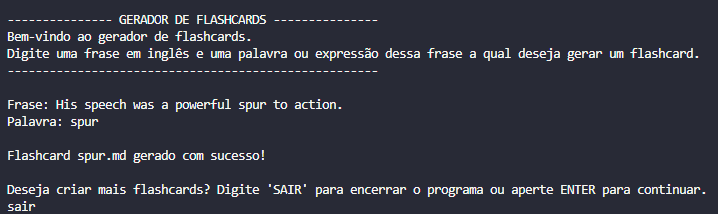

# Flashcards Generator

## ✨ Introdução

Script em Python que utiliza a API do Google AI Studio para gerar flashcards para estudos de inglês.

## ⚙️ Funcionamento

O usuário insere uma frase e uma palavra ou expressão contida nessa frase que ele deseja estudar.

Um agente pesquisador faz uma busca no Google da definição mais relevante para a palavra considerando o contexto da frase.

Um agente professor elabora um flashcard baseado na pesquisa realizada pelo agente pesquisador. O flashcard é gerado num arquivo .md ([Markdown](https://pt.wikipedia.org/wiki/Markdown)) seguindo um padrão de formatação, pronto para ser adicionado em algum programa de repetição espaçada, por exemplo o [Anki](https://apps.ankiweb.net/).

## ❓ Como utilizar

1. **Clone este repositório**

```bash
    git clone [LINK DO SEU REPOSITÓRIO]
    cd [NOME DO SEU REPOSITÓRIO]
```
2. **Configure sua chave da API do Google:**

- Obtenha uma chave da API do Google AI Studio
- Substitua `YOUR_API_KEY` pela sua chave na linha:
```python
    os.environ["GOOGLE_API_KEY"] = "YOUR_API_KEY"
```

3. **Execute o script:**

```bash
    python [nome_do_arquivo.py]
```

4. **Siga as instruções:** Digite uma frase em inglês e uma palavra ou expressão que esteja contida nessa frase que deseja aprender e gerar um flashcard a partir dela. Após isso, o programa irá informar que o flashcard foi criado com sucesso.

- **Exemplo:**



5. **Abra o seu flashcard:** Todos os flashcards gerados são armazenados na pasta `flashcards`

- **Exemplo de flashcard gerado:**

```markdown
FRENTE DO CARTÃO:

His speech was a powerful <b>spur</b> to action.

------

VERSO DO CARTÃO:

<b>spur</b><br><br>
<b>Definition:</b> Something that encourages you to do something.<br><br>
<b>Translation:</b> estímulo, incentivo, impulso<br><br>
<b>Additional examples:</b><br> 
The team's win was a spur to greater effort. (A vitória do time foi um estímulo para um esforço maior.)<br>
The threat of losing pushed the council to act. (A ameaça de perder impulsionou o conselho a agir.)<br>
His words were a spur to change. (As palavras dele foram um incentivo à mudança.)<br>
```

## 💭 O que são flashcards?

Flashcards são cartões de memorização que apresentam uma informação em um dos lados e a resposta ou explicação correspondente no outro. Eles funcionam como ferramentas de aprendizado ativo, exigindo que o usuário tente se lembrar da informação ao ver a pergunta ou conceito.